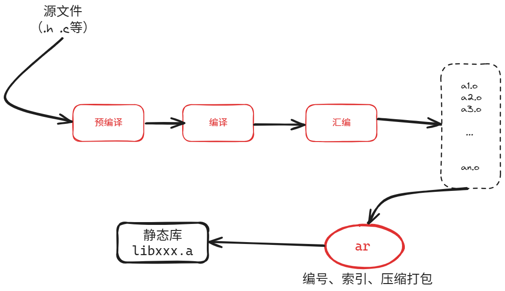
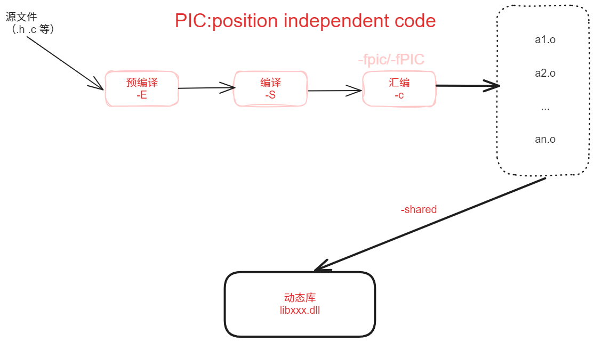

# 花式摆弄静态库与动态库

## 静态库的制作



```bash
ar rcs 静态库的名字(libxxx.a) 原材料(*.o)
```

参数 c ：创建一个库，不管库是否存在，都将创建
参数 s ：创建目标文件索引，可以加快时间
参数 r ：在库中插入模块

```cmake
add_library(common OBJECT common.cpp)
```

OBJECT：生成object_library

```cmake
add_library(add STATIC add.cpp $<TARGET_OBJECTS:common_object>)
```

上面的命令使 libadd.a 包含了 add.cpp 部分和 common.cpp 部分

**未解决的问题：在示例中，制作calculator静态库时也使用了common_object，如果不使用common_object无法形成可执行文件。没有完全实现上级只涉及下一级内容，不设计下下一级。**

## 动态库的制作



**g++ 源文件(*.cpp) -c -fpic**

**G++ -shared 与位置无关的目标文件(*.o) -o 动态库(libxxx.so)**

给目标设置 -fpic：

```cmake
set_target_properties(sub_object PROPERTIES POSITION_INDEPENDENT_CODE ON)
```
